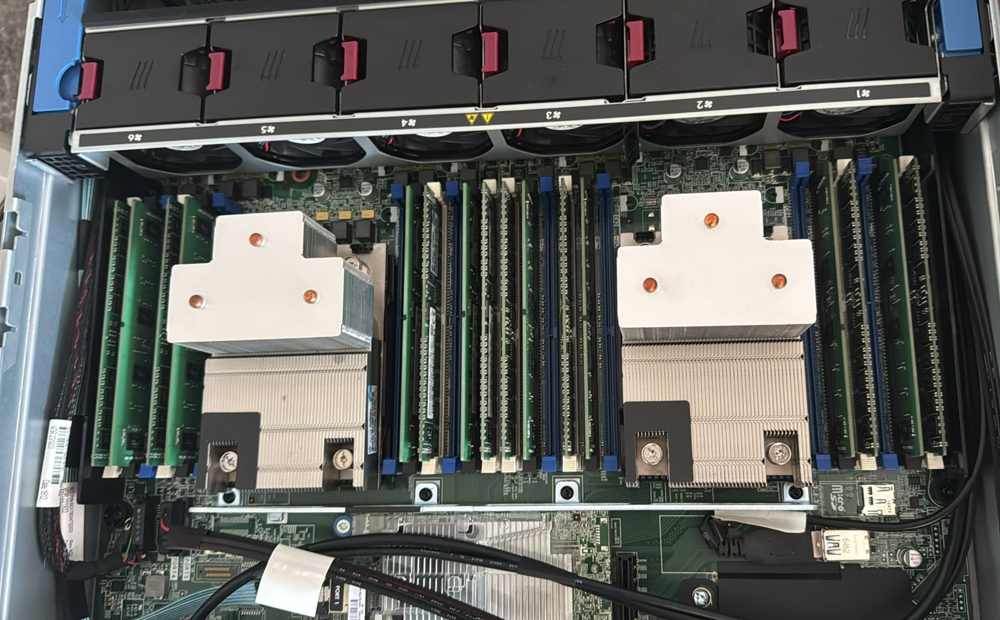

---

## About Me

Hey, I'm **Lennox** a student and self-taught developer from **Germany** with a passion
for building things that actually matter. I've been writing code for years across a wide
range of languages and technologies, and I'm always working on something new.

Right now I'm deep in development on a **custom FiveM framework** with a fully redesigned
TxAdmin interface built from the ground up to give server owners more control, better
tooling, and a cleaner experience than what's out there today.

I'm a strong believer in **open source** and **digital privacy**. I think the internet
should be free, transparent, and owned by its users not harvested and locked down by
corporations pushing their agendas. I actively self-host as much as possible (yes, even
things most people just "accept" from Big Tech), and I think more developers should care
about what they're building and who it serves.

When I'm not coding, you'll probably find me tinkering with my homelab, gaming, or finding
new ways to de-Google my life.

If you share the same values or just want to build something cool together feel free
to reach out. Always happy to connect with like-minded people.

[lennox-rose.com](https://lennox-rose.com) •  admin@lennox-rose.com

## ☕ Support

# Tech Stack

---

